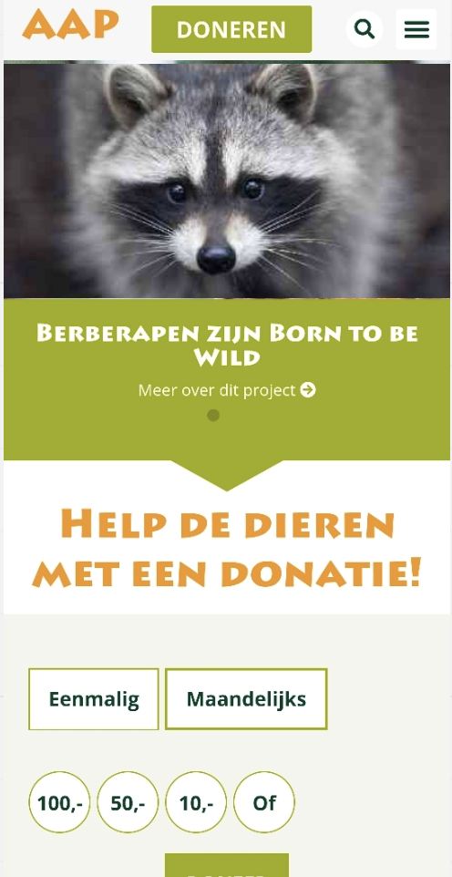
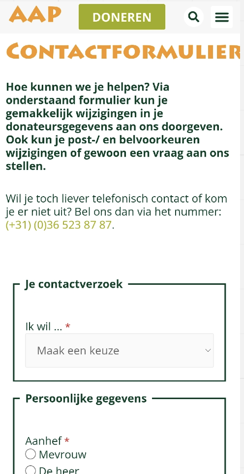
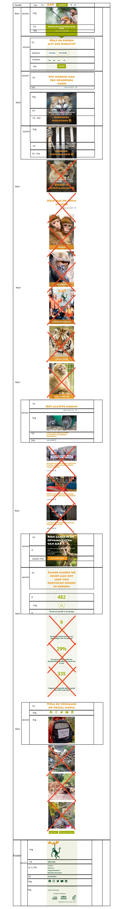
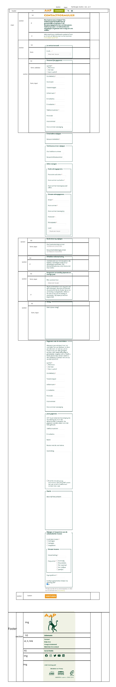
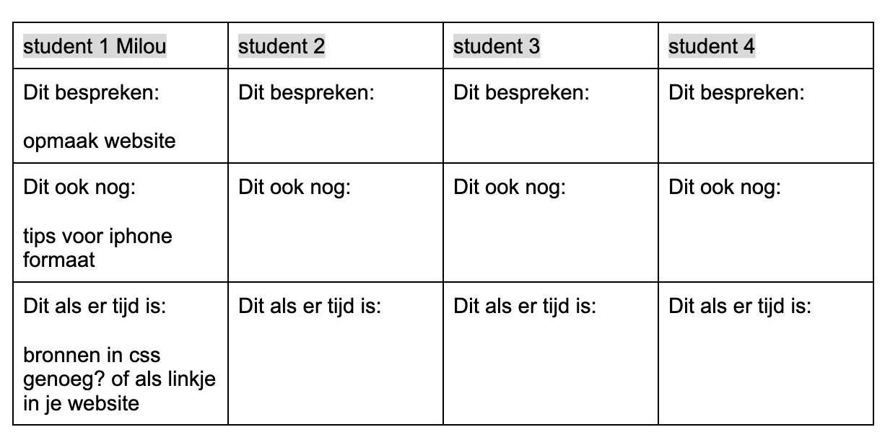
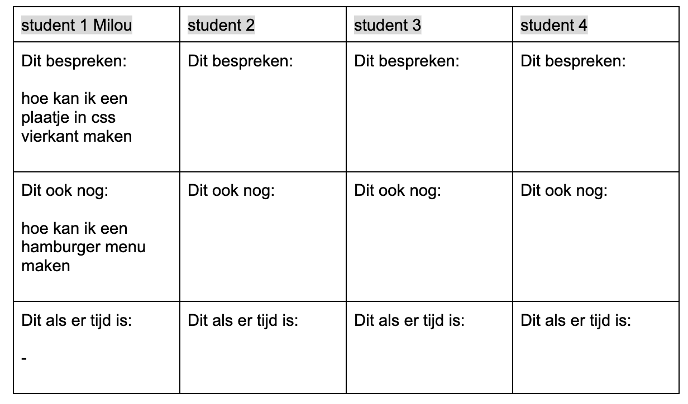

# Procesverslag
Markdown is een simpele manier om HTML te schrijven.  
Markdown cheat cheet: [Hulp bij het schrijven van Markdown](https://github.com/adam-p/markdown-here/wiki/Markdown-Cheatsheet).

Nb. De standaardstructuur en de spartaanse opmaak van de README.md zijn helemaal prima. Het gaat om de inhoud van je procesverslag. Besteedt de tijd voor pracht en praal aan je website.

Nb. Door *open* toe te voegen aan een *details* element kun je deze standaard open zetten. Fijn om dat steeds voor de relevante stuk(ken) te doen.

## Jij

uitwerken voor kick-off werkgroep

### Auteur:
Milou Mulder

#### Je startniveau:
Blauw

#### Je focus:
responsive plane
 

## Je website

uitwerken voor kick-off werkgroep

### Je opdracht:
 <a= href= "https://www.aap.nl/"> stichting aap <a>

#### Screenshot(s) van de eerste pagina (small screen): 
homepage  

#### Screenshot(s) van de tweede pagina (small screen):
contact 

 

## Breakdownschets (week 1)

uitwerken na afloop 2e werkgroep

### de hele pagina: 

### contact pagina: 

## Voortgang 1 (week 2)

uitwerken voor 1e voortgang

### Stand van zaken

Ik loop nog redelijk gelijk met de lessen, maar vind alles nog wel lastig en ik vind het moeilijk om alle termen te onthouden. Ik moet alles gewoon goed bijhouden en meer oefenen met CSS en JS. Mijn website is nog wel kaal als het gaat om CSS dus daar moet ook nog aan gewerkt worden. Ik heb tijdens het werken aan mijn website ook nog wat extra dingen weggehaald uit de breakdownschets, omdat het te veel werd of het me niet lukte. 

### Agenda voor meeting
samen met je groepje opstellen.

### Verslag van meeting
hier na afloop snel de uitkomsten van de meeting vastleggen

- aan mijn css werken 
- html verbeteren 
- volgende keer een andere link in het document zetten 

## Voortgang 2 (week 3)

uitwerken voor 2e voortgang

### Stand van zaken
Ik heb wat meer css in mijn pagina verwerkt, maar ik moet wel volgde week extra hieraan gaan werken. Ook moet ik beginnen aan mijn tweede pagina en werken aan mijn hamburger menu. Het javascript gedeelte viel me nog wel tegen en de opdrachten die we moesten maken met css waren te doen, maar als je die in je eigen website moet verwerken, dan valt het ook nog erg tegen. 

### Agenda voor meeting
samen met je groepje opstellen

### Verslag van meeting
hier na afloop snel de uitkomsten van de meeting vastleggen

- foto's gewoon in photoshop kleiner maken is makkelijk
- hamburger menu moet je even zelf kijken in de opdrachten en sommige opdrachten gewoon opnieuw maken om dat te kunnen maken 

## Toegankelijkheidstest (week 4)

uitwerken na test in 8e voortgang

### Bevindingen
Lijst met je bevindingen die in de test naar voren kwamen:

#### voice-over
Als ik de voice-over test doe, dan leest hij de buttons bijvoorbeeld wel voor maar de tekst zoals titels niet. 

Dit zou opgelost kunnen worden door een naam te geven aan de titels zodat deze ook voorgelezen kunnen worden. 

#### Voice-over 
De stem van de voice-over is mega vervelend. Na een minuut word het al vervelend. 

Ze zouden de stem wat meer mensenlijk kunnen maken en niet zo'n robot stem, maar wat ik zelf zou kunnen doen is de tekst duidelijker maken voor de gebruiker.

#### Voice-over 
Als je op mijn hamburger menu drukt dan zegt hij knop, maar dat is niet heel duidelijk voor de mensen die niet weten dat dat een hamburger menu is.  

Dan kan je misschien de naam veranderen van de button waardoor hij het duidelijker zegt. 

#### Bril blur 
Als je de blur bril op doet dan kan ik de linkjes in het donkergroen over de groene achtergrond en de witte tekst over de plaatjes niet goed lezen en zelfs de oranje tekst bijna niet, alleen als je heel dichtbij zit kan je het lezen.

Als de linkjes en de tekst dikgedrukt zijn en zwart gemaakt worden zou het beter te lezen zijn, maar blijft lastig. 

#### Bril wazig
Als je de de wazige bril op doet kan je ook het groene linkje niet zien 

Als de linkjes dikgedrukt zijn en zwart gemaakt worden zou het beter te lezen zijn 

#### Bril diabetes
Als je de de diabetes bril op doet kan opzich nog wel alles zien, maar je moet wel goed focussen op de letters 

#### motoriek elastiekje 
Je kan door het elastiekje je site nog redelijk bedienen maar het wordt wel lastig   

#### motoriek apparaatje
Je kan door het apparaatje niet heel goed je site bedienen. 

Dit zou je kunnen oplossen door te kunnen tabben door de website met je mond. Dit is wel lastig. 

## Voortgang 3 (week 4)

uitwerken voor 3e voortgang

### Stand van zaken
Ik moet nog veel doen aan mijn tweede pagina, maar dat hoeft niet heel veel werk te zijn. Dat zijn alleen een paar formuliertjes maken en verder is de header en de footer hetzelfde als de eerste pagina die ik heb gemaakt. 

### Agenda voor meeting
samen met je groepje opstellen

| student 1      | student 2          | student 3    | student 4        |
| ---            | ---                | ---          | ---              |
| dit bespreken  | en dit             | en ik dit    | en dan ik dat    |
| en dat ook nog | dit als er tijd is | nog een punt | dit wil ik zeker |
| ...            | ...                | ...          | ...              |

### Verslag van meeting
hier na afloop snel de uitkomsten van de meeting vastleggen

- punt 1
- punt 2
- nog een punt
- ...

## Eindgesprek (week 5)

uitwerken voor eindgesprek

### Stand van zaken
hier dit ging goed & dit was lastig (neem ook screenshots op van delen van je website en code)

### Screenshot(s)

hier screenshot(s) van je eindresultaat

## Bronnenlijst

continu bijhouden terwijl je werkt

Nb. Wees specifiek ('css-tricks' als bron is bijv. niet specifiek genoeg).

1. bron 1
2. bron 2
3. ...

